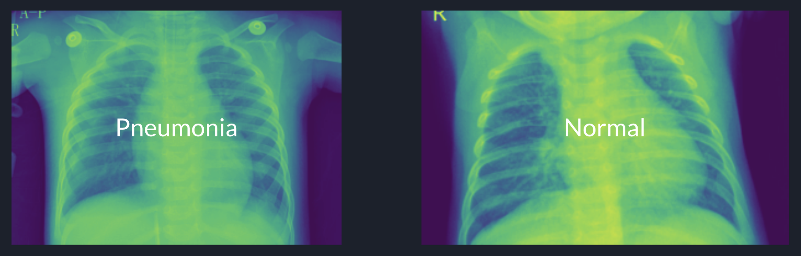

# Pulmonary Radiograph Screenings: Improving Efficiency & Accuracy in Healthcare Diagnosis

## Introduction

Never more than now have medical practitioners been bogged down by a never ending list of tasks which keep them from doing the important work of interacting with patients and thinking criticall about intervetions. Any measure which would decrease time spent waiting around for results prior to intervetion is precious time for the patient, and an accurate measure has the potential to mitigate false diagnosis.

This project sought to use patient radiograph images to create an algrorithm that can reliably detect pneumonia in a chest xray. In one study a false negative rate of 11.4% was reported in manual readings of chest xrays for diagnosis of pneumonia - this is a problem at baseline but especially in the times of COVID-19. Pneumonia is one of the symptoms associated with more severe cases of COVID and early recognition and treatment could be the difference between life and death for a patient. Our intention is to mitigate these mistakes.

## Navigating the Repo

1. Pulmonary_Predictions_Real: Notebook contains EDA, modeling, and validation of algrothim
2. Slidedeck: Nontechnical presentation

## Methodology

Dataset:

The dataset was derived from a Kaggle competition. You can find the competition and further information cocnerning this dataset [here](https://www.kaggle.com/paultimothymooney/chest-xray-pneumonia).

A convoluted nerual network was used to derive the algorithm.

## Limitations

This dataset is described as the following:

'Chest X-ray images (anterior-posterior) were selected from retrospective cohorts of pediatric patients of one to five years old from Guangzhou Women and Children’s Medical Center, Guangzhou. All chest X-ray imaging was performed as part of patients’ routine clinical care.'

In medicine, the protocol for diagnosis and treatment is often different between pediatric and adults populations. Although this model is still applicable, the pediatric nature of the images is a limitation of the study.

## Results

Our model was successful and achieved the following statistics:

Accuracy: 91%

Sensitivity: 93%

Specificity: 83%

False Positive Rate: 6.2%

False Negatibe Rate: 2.4%

For further explanation of permance measures and how they're used, please visit this [blog post](https://www.the-wandering-scientist.com/post/performance-evaluation-measures-for-dummies).

## Conclusion

With a model that can gives us 91% accuracy, 96% sensitivity, and a false negative rate of 2.4%, we've decreased the risk of missing a positive diagnosis by 9%. Not only does this drastically improve the confidence of diagnosis and decrease time spent reading radiographs by hand, but this opens the door to the future of medical diagnosis standards. What other manual diagnosis processes can we use machine learning to streamline?

## Further Recommendations

Hire and create a task force to evaluate hospital diagnosis processes and begin addressing the disease processes that are most often affected by poor diagnosis processes.

